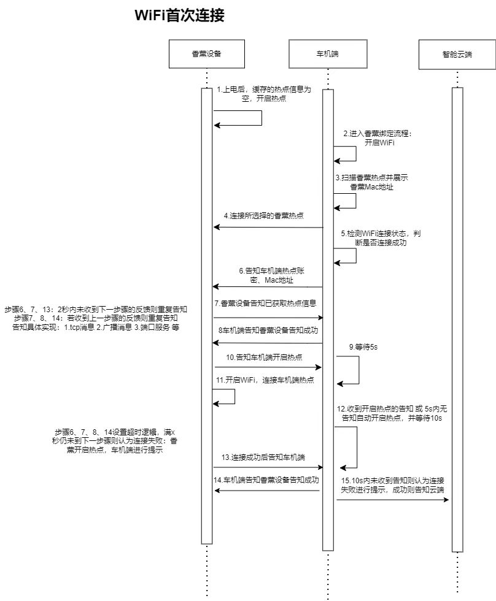

# 配网协议

气味小播上电后，若无缓存的热点信息，则自动进入配网模式

**热点名称**：scent + mac地址，例：scentec6260b5d796

**Server 端 IP**：192.168.4.1:1133

**通讯协议**：TCP

**Server 端**：气味小播

**客户端**：车机




## 配网流程

步骤6：车机端告知气味小播 热点账密，Mac 地址；

```json
{
  "id": 1,
  "content": {
    "ssid": "xxx",
    "password": "pwd",
    "mac": "7e:52:aa:15:a5:35"
  },
  "type": "REQ"
}
```

步骤7：气味小播告知车机端已收到热点信息

```json
{
  "id": 2, // 上一步的 id + 1
  "type": "ACK_REQ"
}
```

步骤8：车机端告知气味小播已收到告知

```json
{
  "id": 3, // 上一步的 id + 1
  "type": "ACK"
}
```

连接成功无需发送消息，车机端根据是否成功建立 WebSocket 连接判断。

## 步骤11

⾹薰设备⼴播内容格式：#scent_⾹薰mac地址_⾹薰ip

例 "#scent_6260b5d796_192.168.4.1"

广播逻辑：香薰设备连接到车机端热点后，广播 10 秒

车机端根据 mac 来校验对应的香薰设备

## 步骤13

建立 WebSocket 连接

服务端：气味小播

通讯方式：WebSocket

通讯协议：TCP

重试机制：每2秒发送一次

超时判断：连接热点的超时时间为 30 秒，连上车机热点建立 WebSocket 连接的超时时间为 10 秒

1. 上电 **120** 秒，认为车机开启热点。 **160** 秒 小播未建立 WebSocket 连接，认为超时
2. 小播连上车机热点后，每 2 秒发送广播，**10** 秒未建立 WebSocket 连接，认为超时
3. 配网后，**30** 秒小播未连接上车机热点，认为超时
4. 配网通讯过程中，需要应答时，**5** 秒 未接到应答，认为超时

超时处理：气味小播重新进入配网模式
